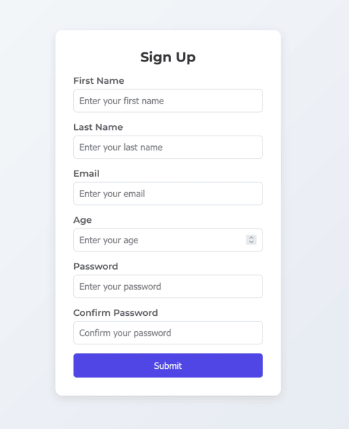

# React Form Validation with Zod + TypeScript 🔒✨



[](https://react-form-validation-basic.vercel.app/)

[](https://react.dev/)
[](https://www.typescriptlang.org/)
[](https://zod.dev/)

A modern form validation implementation using React, TypeScript, and Zod, demonstrating best practices for type-safe form handling.

## Features 🚀

✅ **Robust Validation Rules**
- Required field checks
- Email format validation
- Age range validation (18-70)
- Password strength requirements
- Confirm password match validation

✅ **Type-Safe Implementation**
- Full TypeScript integration
- Auto-generated types from Zod schemas

✅ **Clean Architecture**
- Separation of validation logic (schemas) from UI components
- Custom error messages
- Responsive design

## Installation ⚙️

### 1️⃣ Clone the repository
```bash
git clone https://github.com/your-username/react-form-validation.git
```

### 2️⃣ Install dependencies
```bash
npm install
# or
yarn install
```

### 3️⃣ Run the development server
```bash
npm run dev
# or
yarn dev
```

## Tech Stack 🛠️

- **React 18+** - UI library
- **TypeScript** - Static typing
- **Zod** - Schema validation
- **React Hook Form** - Form state management
- **Vercel** - Deployment

## Key Implementation Details 🔍

### Schema Validation (Zod)
```typescript
// schema.ts
import { z } from "zod";

export const formSchema = z.object({
  email: z.string().email("Invalid email format"),
  age: z.number().min(18, "Must be at least 18").max(70, "Cannot exceed 70"),
  password: z.string().min(6, "Password must be at least 6 characters"),
  confirmPassword: z.string(),
}).refine((data) => data.password === data.confirmPassword, {
  message: "Passwords must match",
  path: ["confirmPassword"],
});
```

### Form Component
```tsx
// App.tsx
import { useForm } from "react-hook-form";
import { zodResolver } from "@hookform/resolvers/zod";
import { formSchema } from "./schema";

const App = () => {
  const { register, handleSubmit, formState: { errors } } = useForm({
    resolver: zodResolver(formSchema),
  });

  return (
    <form onSubmit={handleSubmit((data) => console.log(data))}>
      <input {...register("email")} placeholder="Email" />
      {errors.email && <span className="error">{errors.email.message}</span>}

      <input {...register("age")} type="number" placeholder="Age" />
      {errors.age && <span className="error">{errors.age.message}</span>}

      <input {...register("password")} type="password" placeholder="Password" />
      {errors.password && <span className="error">{errors.password.message}</span>}

      <input {...register("confirmPassword")} type="password" placeholder="Confirm Password" />
      {errors.confirmPassword && <span className="error">{errors.confirmPassword.message}</span>}

      <button type="submit">Submit</button>
    </form>
  );
};

export default App;
```

## Why This Matters 💡

This implementation demonstrates:
- **Type-safe form handling** using Zod + TypeScript
- **Reusable validation logic** through schema separation
- **Clean error handling** with React Hook Form integration
- **Production-ready patterns** for complex form scenarios

---

✅ **Feel free to contribute!** If you have improvements or suggestions, open an issue or create a PR. 🚀
